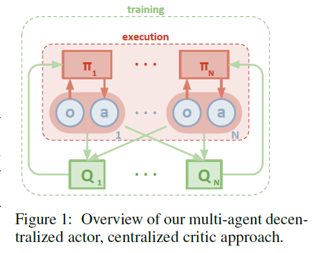

## Learning Algorithm

The learning algorithm used to train the agent was a Multi-Agent Deep Deterministic Policy Gradient (MADDPG).

Deep deterministic policy gradient (DDPG) is a variant of DPG where the policy and critic Q are approximated with deep neural networks. DDPG is an off-policy algorithm, and samples trajectories from a replay buffer of experiences that are stored throughout training. DDPG also makes use of a target network, as in DQN.

MADDPG is a simple extensionn of DDPG where the critic is augmented with extra information about the policies of other agents while the actor only has access to local information. This framework adopts the use of the centralized training with the decentralized execution. This allows the policies to use extra information to ease training but this information is not used at test time. The primary motivation behind MADDPG is that, if the actions taken by all agents are known, then the environment is stationary even as the policies change.

MADDPG is comprised of two phases as shown in the diagram below:

- Training phase: During training, the critic for each agent uses extra information like state's observed and actions taken by all the other agents. As for the actor, each actor has access to only its agent's observation and actions.

- Execution phase: After training is completed, only the local actors are used at execution phase, acting in a decentralized manner and equally applicable in cooperative and competitive settings. Learning critic for each agent allows us to use a different reward structure for each. Hence the algorithm can be used in all cooperative, competitive, and mixed scenarios.

#### The Model Architecture for the Actor Network:

- State Space Size (24)
- Action Space Size (2)

- Linear Layer 1 (inputs = 24, outputs = 128)
- Leaky Relu Activation Function
- Linear Layer 2 (inputs = 128, outputs = 128)
- Leaky Relu Activation Function
- Linear Layer 3 (inputs = 128, outputs = 2)
- Tanh Activation Function

#### The Model Architecture for the Critic Network:

- State Space Size (24 * 2) # 2 agents
- Action Space Size (2 * 2) # 2 agents

- Linear Layer 1 (inputs = 48, outputs = 128)
- Leaky Relu Activation Function
- Concatenation Layer(layers = 128 + 4 = 132)
- Linear Layer 2 (inputs = 132, outputs = 128)
- Leaky Relu Activation Function
- Linear Layer 3 (inputs = 128, outputs = 1)

#### The Hyperparameters:

- BUFFER_SIZE = int(1e5)  # replay buffer size
- BATCH_SIZE = 128        # minibatch size
- GAMMA = 0.99            # discount factor
- TAU = 1e-3              # for soft update of target parameters
- LR_ACTOR = 1e-5         # learning rate of the actor
- LR_CRITIC = 1e-4        # learning rate of the critic
- WEIGHT_DECAY = 0        # L2 weight decay
- UPDATE_NETWORK_FREQUENCY = 3      # how many steps the network is updated
- THETA: 0.15             # revert speed to mean
- SIGMA: 0.2              # degree of volatility

## Plot of Rewards

Here we see a plot of rewards per training episode to illustrate that the agent is able to receive an average reward (over 100 episodes) of at least +0.5. The environment was solved in 2311 episodes.

## Ideas for Future Work

There are many ways that this agent could be improved in the future. I will list a few ideas here that could be tested.

1. Experiment more with the actor and critic network architectures. More layers, more nodes, batchnorm, dropout.
2. Experiment more with the model training hyperparameters. Batch_size, LR, sigma, weight decay.
3. Attempt to improve upon the MADDPG algorithm as suggested in the paper, "Multi-Agent Actor-Critic for Mixed
Cooperative-Competitive Environments" in the following way:

"We have proposed a multi-agent policy gradient algorithm where agents learn a centralized critic
based on the observations and actions of all agents. Empirically, our method outperforms traditional
RL algorithms on a variety of cooperative and competitive multi-agent environments. We can further
improve the performance of our method by training agents with an ensemble of policies, an approach
we believe to be generally applicable to any multi-agent algorithm.
One downside to our approach is that the input space of Q grows linearly (depending on what
information is contained in x) with the number of agents N. This could be remedied in practice by,
for example, having a modular Q function that only considers agents in a certain neighborhood of a
given agent. We leave this investigation to future work."

## References

[Multi-Agent Actor-Critic for Mixed Cooperative-Competitive Environments](https://papers.nips.cc/paper/7217-multi-agent-actor-critic-for-mixed-cooperative-competitive-environments.pdf)
